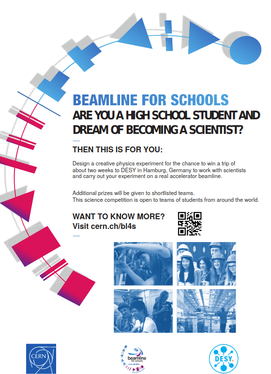

# Aktiviteetit

Tällä sivulla on listattuna sivustoja, joista voit löytää hiukkasfysiikkaan (ja muuhunkin) liittyviä aktiviteetteja luokkahuoneessa toteutettavaksi.

## S'Cool LAB

[S'Cool LAB](https://scoollab.web.cern.ch/) on fysiikan koulutuksen tutkimuskeskus CERN:ssä. Se tarjoaa lukiolaisille ja heidän opettajilleen työpajoja CERN-vierailuilla, mutta myös [aktiviteettiehdotuksia](https://scoollab.web.cern.ch/classroom-activities) luokkahuoneessa toteutettaviksi. Aktiviteetteihin kuuluu mm. erilaisia [3D-printattavia](https://scoollab.web.cern.ch/laserlab3D) koejärjestelmiä, [ohjeet](https://scoollab.web.cern.ch/cloud-chamber) kotitekoisen sumukammion tekemiseen tai [kuplakammiokuvia](https://scoollab.web.cern.ch/bubble-chamber-pictures-classroom) tutkittavaksi. 

## Perimeter Institute

Paljon englanninkielistä materiaalia mm. hiukkasfysiikan aiheista löytyy Perimeter Institute:n sivuilta: [https://resources.perimeterinstitute.ca/collections/particle-physics](https://resources.perimeterinstitute.ca/collections/particle-physics).

Esimerkiksi [Beyond the Atom: Remodelling Particle Physics](https://resources.perimeterinstitute.ca/collections/particle-physics/products/beyond-the-atom-remodelling-particle-physics)-paketti sisältää opetusvideon ja viisi aktiviteettia, kuten kuplakammiokuvien tulkintaa tai huippukvarkin etsimistä. Materiaalit ovat ilmaisia, mutta vaativat käyttäjätunnuksen tekemisen sivustolle.

Alla esimerkkinä Perimeter Institute:n luokkahuonedemo Rutherfordin kokeesta
<figure class="video_container">
	<iframe width="560" height="315" src="https://www.youtube.com/embed/Cw6dvCwfyuU" frameborder="0" allow="accelerometer; autoplay; clipboard-write; encrypted-media; gyroscope; picture-in-picture" allowfullscreen></iframe>
</figure>

## The Wonders of Physics

[Täältä](https://sites.google.com/site/306physics/particlephysics) löydät yhdysvaltalaisen lukio-opettajan tekemää hiukkasfysiikan materiaalia sisältäen aktiviteetteja, tehtäviä, tuntisuunnitelmia yms.

## Beamline for Schools -kilpailu

CERN järjestää vuosittain kansainvälisen lukio-opiskelijoiden kilpailun, jossa kehitetään koe, joka voitaisiin toteuttaa hiukkaskiihdyttimellä. Voittajat pääsevät matkalle toteuttamaan oman kokeensa täysin varustellulla hiukkaskiihdyttimellä. Lisätietoja kilpailusta ja ohjeet osallistumiseen löytyy [täältä](https://beamlineforschools.cern/).

Alla esite vuoden 2021 kilpailusta.

