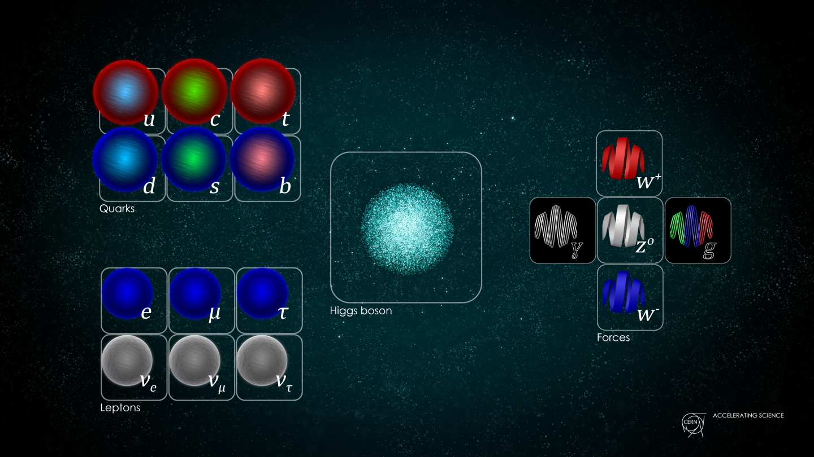

# Hiukkasfysiikka

## Hiukkasfysiikan standardimalli

<figure class="video_container">
    <iframe width="808" height="454.5" src="https://www.youtube.com/embed/ehHoOYqAT_U" frameborder="0" allow="accelerometer; autoplay; clipboard-write; encrypted-media; gyroscope; picture-in-picture" allowfullscreen></iframe>
</figure>

Hiukkasfysiikka tutkii aineen pienimpiä rakennuspalikoita ja näiden välisiä vuorovaikutuksia.
Kaikki alkuaineet voidaan rakentaa ainoastaan kolmen hiukkasen - protonin, neutronin ja elektronin - avulla.
Protonit ja neutronit koostuvat kuitenkin vielä pienemmistä hiukkasista, kvarkeista.
Tarkemmin sanottuna protoni koostuu kahdesta ylös-kvarkista ja yhdestä alas-kvarkista ja vastaavasti neutroni koostuu kahdesta alas-kvarkista ja yhdestä ylös-kvarkista.
Teoriaa, joka kuvaa aineen pienimpiä rakennusosia sekä niiden välisiä vuorovaikutuksia, kutsutaan hiukkasfysiikan standardimalliksi.
Standardimallin kuvaamat alkeishiukkaset voidaan jakaa fermionit ja bosonit.
Standarimallin mukaan fermioneja, joita joskus kutsutaan myös ainehiukkasiksi, ovat kvarkit (ylös, alas, outo, lumo, huippu, pohja) ja leptonit (elektroni, myoni, tau, sekä näitä vastaavat neutriinot).
Kaikilla fermioneilla on lisäksi antihiukkanen, esimerkiksi elektronin antihiukkanen on positroni.
Bosoneihin puolestaan kuuluvat perusvuorovaikutusten välittäjähiukkaset fotoni, W- ja Z-bosonit sekä gluoni.
Lisäksi bosoneihin kuuluu mallin uusin tulokas Higgsin bosoni, joka löydettiin CERN:ssä vuonna 2012.
Alla olevaan kuvaan on koottu hiukkasfysiikan standardimallin mukaiset hiukkaset.


*Standardimallin alkeishiukkaset (Credit: CERN)*

### Standardimallin haasteet

Hiukkasfysiikan standardimalli pystyy selittämään sen, miten kaikki tuntemamme aine koostuu kvarkeista ja leptoneista sekä sen, miten ne vuorovaikuttavat keskenään välittäjähiukkasten avulla.
Standardimalli kuvaa kolme neljästä perusvuorovaikutuksesta: sähkömagneettisen vuorovaikutuksen sekä vahvan ja heikon vuorovaikutuksen.
Standardimalli ei kuitenkaan pysty selittämään gravitaatiota, jonka voimakkuus on paljon heikompi kuin muiden vuorovaikutusten.
On spekuloitu, että gravitaatiota välittäisi gravitoniksi nimetty alkeishiukkanen, mutta tätä ei ole pystytty todistamaan.

Toinen selittämätön ilmiö on aine-aintiaine-epäsymmetria.
Standardimallin mukaan alkuräjähdyksessä olisi pitänyt syntyä yhtä paljon ainetta ja antiainetta.
Universumimme koostuu kuitenkin kokonaan tavallisesta aineesta.
Minne antiaine on kadonnut?
Katso animaatio, jossa kerrotaan tarkemmin antimateriasta ja epäsymmetriasta (Kesto 5:16).
<figure class="video_container">
    <iframe width="808" height="454.5" src="https://www.youtube.com/embed/CtR5EkvLNfg" frameborder="0" allow="accelerometer; autoplay; clipboard-write; encrypted-media; gyroscope; picture-in-picture" allowfullscreen></iframe>
</figure>

Standardimalli ei pysty selittämään myöskään pimeää ainetta tai pimeää energiaa.
Pimeän energian osuus maailmankaikkeuden massaenergiasta on 68,3% kun taas pimeän aineen osuus on 26,8% ja tavallisen aineen 4,9%.

## Hiukkasseikkailu

<a href="https://particleadventure.org/index.html" target="_blank">The Particle Adventure</a> on interaktiivinen sukellus kvarkkien, neutriinojen, antimaterian, pimeän aineen sekä hiukkaskiihdyttimien ja -ilmaisimien maailmaan. Sivustolta löytyy valtava määrä tietoa, jonka avulla voi perehtyä tarkemmin mm. standardimalliin, hiukkaskiihdyttimiin ja -ilmaisimiin tai hiukkasfysiikan selvittämättömiin kysymyksiin.

<a href="https://particleadventure.org/index.html" target="_blank"></a>

## Higgsin bosonin löytö

CERN:n fyysikko selittää kolmiosaisessa videosarjassa esimerkkien avulla mm. miten uusia hiukkasia löydetään ja miksi piikki histogrammissa selittää hiukkasen olemassaolon.

- Osa 1: <a href="https://www.youtube.com/watch?v=so2nCu2Jkbc" target="_blank">https://www.youtube.com/watch?v=so2nCu2Jkbc</a> (Kesto 6:54)
<figure class="video_container">
    <iframe width="808" height="454.5" src="https://www.youtube.com/embed/so2nCu2Jkbc" frameborder="0" allow="accelerometer; autoplay; clipboard-write; encrypted-media; gyroscope; picture-in-picture" allowfullscreen></iframe>
</figure>

- Osa 2: <a href="https://www.youtube.com/watch?v=pW4LTunlXS4" target="_blank">https://www.youtube.com/watch?v=pW4LTunlXS4</a> (Kesto 7:13)
- Osa 3: <a href="https://www.youtube.com/watch?v=8-WFBGCvv-w" target="_blank">https://www.youtube.com/watch?v=8-WFBGCvv-w</a> (Kesto 12:30)
- Osa 3.5: <a href="https://www.youtube.com/watch?v=0USWORsTza0" target="_blank">https://www.youtube.com/watch?v=0USWORsTza0</a> (Kesto 7:49)
    - Vastauksia katsojien kysymyksiin

## Linkkejä

 ```{list-table}
---
header-rows: 0
widths: 45 45 10
---

* - **Higgsin Kenttä** Animaatio, joka selittää, miten Higgsin kenttä toimii
   - <a href="https://www.youtube.com/watch?v=joTKd5j3mzk" target="_blank">https://www.youtube.com/watch?v=joTKd5j3mzk</a>
   - 3:19
* - **LHC FAQ** LHC:hen liittyviä faktoja ja fysiikkaa LHC:n taustalla.
   - <a href="https://home.cern/sites/home.web.cern.ch/files/2018-07/CERN-Brochure-2017-002-Eng.pdf" target="_blank">https://home.cern/sites/home.web.cern.ch/files/2018-07/CERN-Brochure-2017-002-Eng.pdf</a>
   -
* - The International Particle Physics Outreach Group:n (**IPPOG**) sivuilta löytyy hiukkasfysiikkaan liittyvää tietoa ja opetusmateriaalia.
   - <a href="https://ippog.org/" target="_blank">https://ippog.org/</a>
   -
* - **QuarkNet** on Yhdysvaltalainen järjestö, joka tarjoaa luonnontieteen opettajille keinoja tuoda oikeaa tutkimusta opetukseen.
   - <a href="https://quarknet.org/" target="_blank">https://quarknet.org</a>
   -
```
