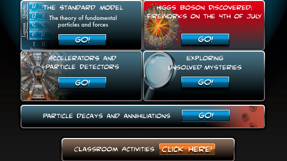

# Hiukkasfysiikka

## Hiukkasseikkailu

[The Particle Adventure](https://particleadventure.org/index.html) on interaktiivinen sukellus kvarkkien, neutriinojen, antimaterian, pimeän aineen sekä hiukkaskiihdyttimien ja -ilmaisimien maailmaan. Sivustolta löytyy valtava määrä tietoa, jonka avulla voi perehtyä hiukkasfysiikkaan.

## Hiukkasfyysikon päivä

Luulitko tietäväsi millaista fyysikon elämä on? Et ole varmasti nähnyt sitä tällä tavalla. Videolla näet Tšekkiläisen fyysikon tyypillisen päivän seuraamalla häntä livenä sekä animaatioiden kautta ja opit samalla upeita faktoja hiukkasfysiikasta ja sen tutkimuksesta. Kesto 30:49.

<figure class="video_container">
	<iframe width="560" height="315" src="https://www.youtube.com/embed/e0Lv2GrsXig" frameborder="0" allow="accelerometer; autoplay; clipboard-write; encrypted-media; gyroscope; picture-in-picture" allowfullscreen></iframe>
</figure>

## Aktiviteetit

### S'Cool LAB

[S'Cool LAB](https://scoollab.web.cern.ch/) on fysiikan koulutuksen tutkimuskeskus CERN:ssä. Se tarjoaa lukiolaisille ja heidän opettajilleen työpajoja CERN-vierailuilla, mutta myös [aktiviteettiehdotuksia](https://scoollab.web.cern.ch/classroom-activities) luokkahuoneessa toteutettaviksi. Aktiviteetteihin kuuluu mm. erilaisia [3D-printattavia](https://scoollab.web.cern.ch/laserlab3D) koejärjestelmiä, [ohjeet](https://scoollab.web.cern.ch/cloud-chamber) kotitekoisen sumukammion tekemiseen tai [kuplakammiokuvia](https://scoollab.web.cern.ch/bubble-chamber-pictures-classroom) tutkittavaksi. 

### Perimeter Institute

Paljon englanninkielistä materiaalia mm. hiukkasfysiikan aiheista löytyy Perimeter Institute:n sivuilta: [https://resources.perimeterinstitute.ca/collections/particle-physics](https://resources.perimeterinstitute.ca/collections/particle-physics).

Esimerkiksi [Beyond the Atom: Remodelling Particle Physics](https://resources.perimeterinstitute.ca/collections/particle-physics/products/beyond-the-atom-remodelling-particle-physics)-paketti sisältää opetusvideon ja viisi aktiviteettia, kuten kuplakammiokuvien tulkintaa tai huippukvarkin etsimistä. Materiaalit ovat ilmaisia, mutta vaativat käyttäjätunnuksen tekemisen sivustolle.

### Beamline for Schools -kilpailu

CERN järjestää vuosittain kansainvälisen lukio-opiskelijoiden kilpailun, jossa kehitetään koe, joka voitaisiin toteuttaa hiukkaskiihdyttimellä. Voittajat pääsevät matkalle toteuttamaan oman kokeensa täysin varustellulla hiukkaskiihdyttimellä. Lisätietoja kilpailusta ja ohjeet osallistumiseen löytyy [täältä](https://beamlineforschools.cern/).

Alla esite vuoden 2021 kilpailusta.

### Lisää aktiviteetteja

[Täältä](https://sites.google.com/site/306physics/particlephysics) löydät yhdysvaltalaisen lukio-opettajan tekemää hiukkasfysiikan materiaalia sisältäen aktiviteetteja, tehtäviä, tuntisuunnitelmia yms.

## Muuta

Lisää englanninkielistä materiaalia:

[https://particleadventure.org/index.html](https://particleadventure.org/index.html)

[https://sites.google.com/site/306physics/home](https://sites.google.com/site/306physics/home)

[https://ippog.org/](https://ippog.org/)

[https://iopscience.iop.org/article/10.1088/1742-6596/1287/1/012045/meta](https://iopscience.iop.org/article/10.1088/1742-6596/1287/1/012045/meta)

[http://physicsmasterclasses.org/index.php?cat=country](http://physicsmasterclasses.org/index.php?cat=country)

[https://quarknet.org/data-portfolio](https://quarknet.org/data-portfolio)

demot: 

- [https://www.youtube.com/watch?v=Cw6dvCwfyuU](https://www.youtube.com/watch?v=Cw6dvCwfyuU) Rutherfordin koe

	<figure class="video_container">
		<iframe width="560" height="315" src="https://www.youtube.com/embed/Cw6dvCwfyuU" frameborder="0" allow="accelerometer; autoplay; clipboard-write; encrypted-media; gyroscope; picture-in-picture" allowfullscreen></iframe>
	</figure>