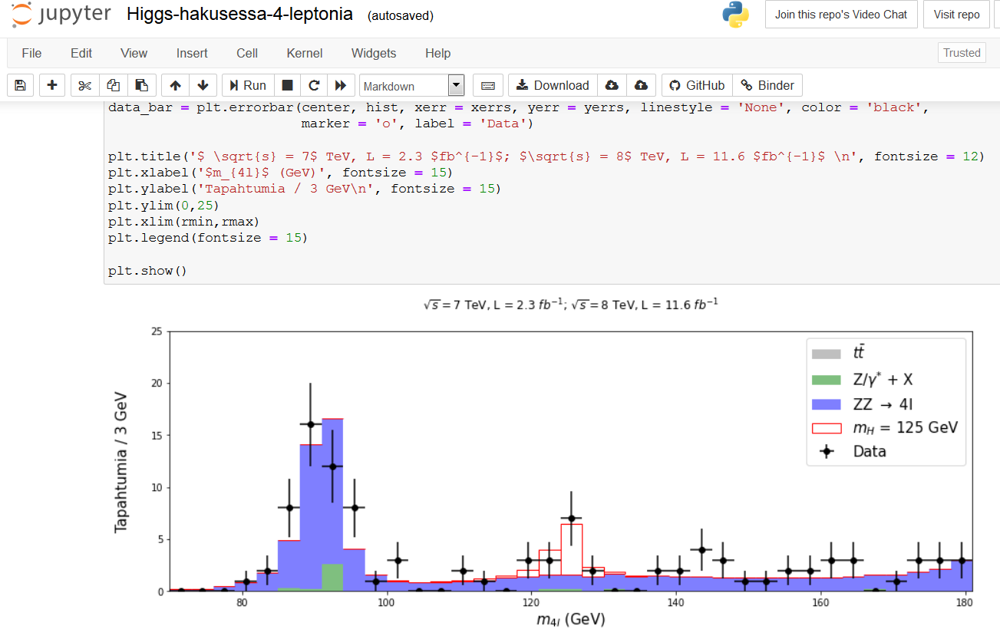
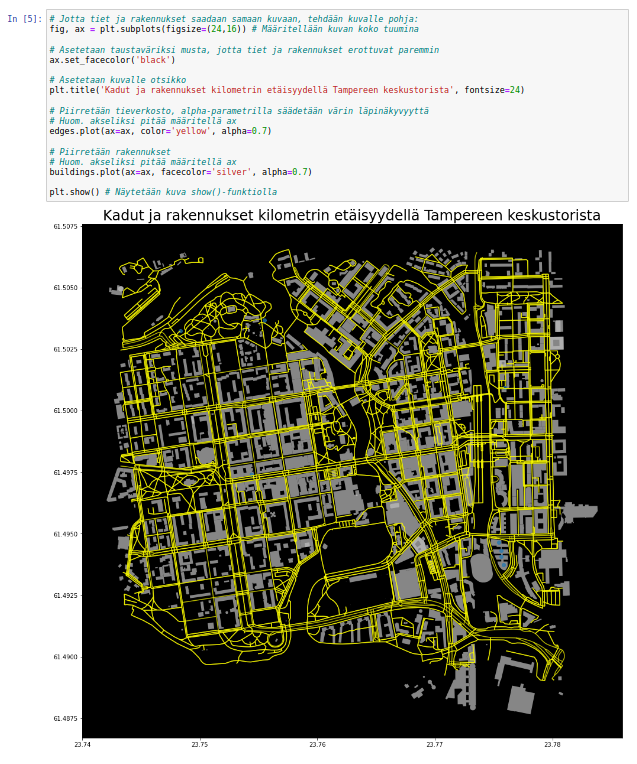

# CERN:n avoin data opetuksessa

Täältä löydät opetuskäyttöön tarkoitettua materiaalia, joissa hyödynnetään CERN:n CMS-mittauslaitteistolla tuotettua avointa dataa.
Materiaalissa hyödynnetään Python-ohjelmointia ja interaktiivisia Jupyter Notebook -ympäristöjä.
Materiaali sisältää valmiita opetuskokonaisuuksia oppitunneilla käytettäväksi sekä yksittäisiä demonstraatioita ja harjoituksia.
Opetuskokonaisuuksien sisällöt vaihtelevat hiukkasfysiikasta data-analyysiin ja kokonaisuuksien pituudet yhdestä oppitunnista useampaan. Materiaalien käyttämiseksi et tarvitse aikaisempaa kokemusta ohjelmoinnista tai käytettävistä ohjelmistoista. Materiaaleihin pääset [tästä linkistä](https://avoin-data-opas.github.io/).

Jos data-analyysi tai ohjelmointi kiinnostaa laajemminkin, tarjolla on Jupyter Notebook -ympäristössä kehitettyä materiaalia myös muista kuin hiukkasfysiikan aiheista, esimerkiksi biologiasta tai maantieteestä. Näihin materiaaleihin pääset [tästä linkistä](https://opendata-education.github.io/).

